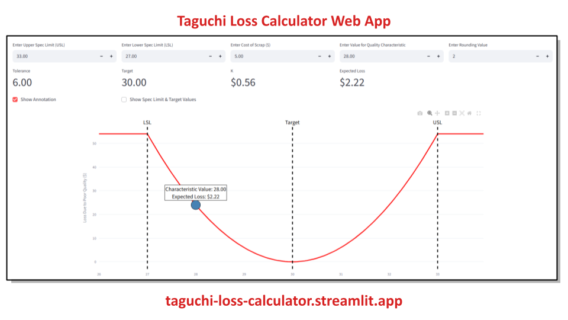

# Taguchi Loss Calculator

An interactive web app for calculating loss due to poor quality using the Taguchi loss function.

## Preview

## Features
- Calculate expected loss for a single measurement
- Calculate expected average loss for a distribution of measurements
- Upload CSV files or enter parameters manually

## Live App
[Click here to use the app](https://taguchi-loss-calculator.streamlit.app/)

## About
Built by Jim Lehner as part of [The Broken Quality Initiative](https://www.brokenquality.com/).

## Run Locally
pip install -r requirements.txt
streamlit run taguchi_loss_calculator.py